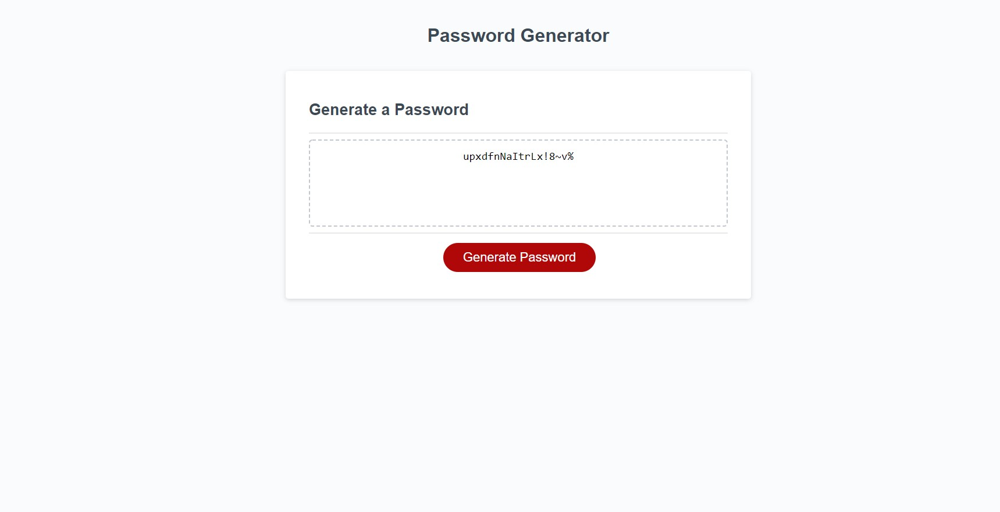

# Name

Secure_Password_Generator

# Description
This webpage generates a random password based you your selected criteria.

You will choose the desired password length between 8-128 characters.

Next you are prompted to select the criteria you want your password to meet.

choose if you want to include uppercase, lowercase, number and special characters to your password.

Your password will then be displayed on the screen.

Click the link to view the live webpage and create your own secure password.

https://laurencvengros.github.io/Secure_Password_Generator/

View a screenshot of the webpage below.

